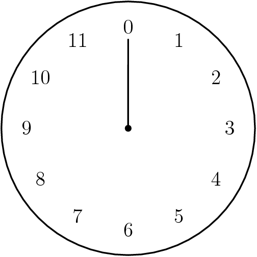

## Motivación

Muchas veces en programación competitiva nos encontramos con problemas que involucran números muy grandes. Para poder entregar soluciones que no sobrepasen el límite del tipo de dato `int` o `long long` se usa aritmética modular. El cual acorta los números a un rango específico y mantiene un buen funcionamiento de las operaciones.

Otro uso de aritmética modular es ver la divisibilidad de un número entre otro, o si un número es primo o no. Además de su uso directo en problemas de tópico matemático, puede ser de ayuda cuando haya una noción _ciclo_ involucrado en el problema.

{: .center-image #reloj-aritmetica-modular}

Imagina que tienes un reloj de 12 horas y quieres saber qué hora es en 5 horas más. Si no usas aritmética modular, tendrías que hacer la cuenta de $x + 5$. Pero tendrías que hacer una condición para ver si la hora es mayor a 12 y restarle 12. Con aritmética modular, la hora correcta es $x + 5 \mod 12$.

La primera solución sería hacer algo así:

```cpp
int x = 7;
int ans = x + 5;
if (ans > 12) ans -= 12;
cout << ans << '\n';
```

En cambio, con aritmética modular, la solución sería:

```cpp
int x = 7;
int y = (x + 5) % 12;
cout << y; // 12
```

Los lengajes de programación tienen implementaciones de aritmética modular con el operador `%`.

Después de esta breve introducción, formalicemos (no en mayor medida) la aritmética modular.

## Definición

Diremos que un número $a$ es congruente a $b$ módulo $n$ si $a \equiv b \pmod{n}$. Esto significa que $a$ y $b$ son _iguales_ cuando se mira el resto que dejan al dividirlos entre $n$. Por ejemplo, $5 \equiv 2 \pmod{3}$, ya que $5 = 2 \cdot 3 + 2$ y $2 = 3 \cdot 0 + 2$.

En `C++`, podemos usar el operador `%` para calcular el resto de la división de dos números. Por ejemplo, $5 \mod 3 = 2$ se puede calcular como `5 % 3`.

## Propiedades

Procederemos a enunciar algunas propiedades importantes al momento de operar en aritmética modular.

### Propiedad de la suma de congruencia

Si $a \equiv b \pmod{n}$ y $c \equiv d \pmod{n}$, entonces $a + c \equiv b + d \pmod{n}$.

Esto nos es útil para separar sumas en módulo $n$. Por ejemplo, si queremos calcular $2 + 3 + 4 \mod 5$, podemos calcular $2 + 3 \mod 5$ y luego sumarle $4 \mod 5$.

### Propiedad de la multiplicación de congruencia

Si $a \equiv b \pmod{n}$ y $c \equiv d \pmod{n}$, entonces $ac \equiv bd \pmod{n}$.

Esto nos es útil para separar multiplicaciones en módulo $n$. Por ejemplo, si queremos calcular $2 \cdot 3 \cdot 4 \mod 5$, podemos calcular $2 \cdot 3 \mod 5$ y luego multiplicarle $4 \mod 5$. También podemos usar esta propiedad para calcular potencias en módulo $n$.

### Propiedad de la inversa de suma congruencia

Si $a \equiv b \pmod{n}$, entonces $a - b \equiv 0 \pmod{n}$.

Esto nos da la noción de elemento inverso en aritmética modular. Que es útil al momento de hacer ecuaciones lineales en módulo $n$.

### Propiedad de la inversa de multiplicación congruencia

Si $a \equiv b \pmod{n}$ y $b \neq 0$, entonces $a \cdot b^{-1} \equiv 1 \pmod{n}$. Donde $b^{-1}$ es el inverso de $b$ en el [grupo de multiplicación módulo $n$](https://es.wikipedia.org/wiki/Grupo_multiplicativo_de_enteros_m%C3%B3dulo_n){:target="_blank"}. O sea, el número $b^{-1}$ tal que $b \cdot b^{-1} \equiv 1 \pmod{n}$.
